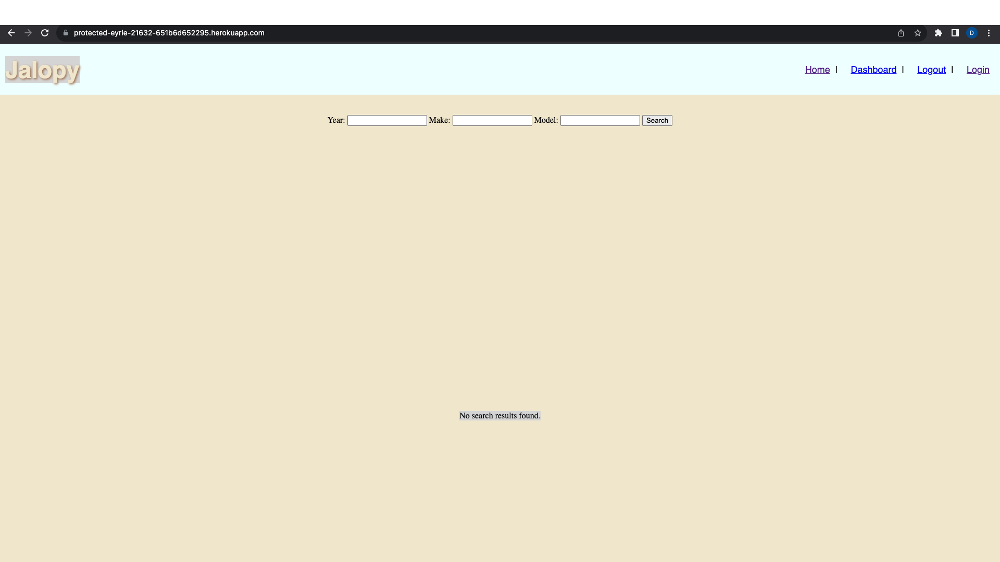

<!-- # jalopy-blog

## Description
The code included in this repository is used to 

## Usage

The Github repository can be found here: https://github.com/dscornaienchi/jalopy-blog

The deployed application can be found here:

A screenshot of the application is shown here: 


## Credits

Tutorials and instruction provided by the University of Texas at Austin Full Stack Web Developement Program and it's affiliated professors and TA's.  -->


<a name="readme-top"></a>


<!-- PROJECT LOGO -->
<br />
<div align="center">
    
  <p align="center">
    A Forum to review all cars through 2000-2023
    <br />
    <a href="https://github.com/dscornaienchi/jalopy-blog"><strong>Github Repo»</strong></a>
    <br />
  </p>
</div>


<!-- TABLE OF CONTENTS -->
<details>
  <summary>Table of Contents</summary>
  <ol>
    <li>
      <a href="#about-the-project">About The Project</a>
    </li>
    <li>
      <a href="#getting-started">Getting Started</a>
      <ul>
        <li><a href="#installation">Installation</a></li>
      </ul>
    </li>
    <li><a href="#usage">Usage</a></li>
    <li><a href="#acknowledgments">Acknowledgments</a></li>
  </ol>
</details>


<!-- ABOUT THE PROJECT -->
## About The Project



Desription - A blog for Automobile owners to express their opinions about the car of their choice. The years range from 2000 to 2023. This program has the most popular makes and models from the year range mentioned above.

Motivation for development - Users today are left to either skim reddit threads or read professional reviews. This website allows common people to find each other’s reviews

User story - As a user, I want to search for a car, find reviews, and be able to a leave a review for a selected car

<p align="right">(<a href="#readme-top">back to top</a>)</p>


<!-- GETTING STARTED -->
## Getting Started


### Installation


1. Install NPM packages
   ```sh
   npm install
   ```
2. Enter the schema.sql and seeds2.sql file paths into mysql
   ```js
   mysql> source db/schema.sql
   ```
   ```
    mysql> source db/seeds2.sql
   ```
3. Run nodemon server.js
    ```
    nodemon server.js
    ```

<p align="right">(<a href="#readme-top">back to top</a>)</p>


<!-- USAGE EXAMPLES -->


## Usage

The Github repository can be found here: https://github.com/dscornaienchi/jalopy-blog

The deployed application can be found here:
https://protected-eyrie-21632-651b6d652295.herokuapp.com/ 


<p align="right">(<a href="#readme-top">back to top</a>)</p>


<!-- ACKNOWLEDGMENTS -->
## Acknowledgments

Tutorials and instruction provided by the University of Texas at Austin Full Stack Web Developement Program and it's affiliated professors and TA's.  


<p align="right">(<a href="#readme-top">back to top</a>)</p>


